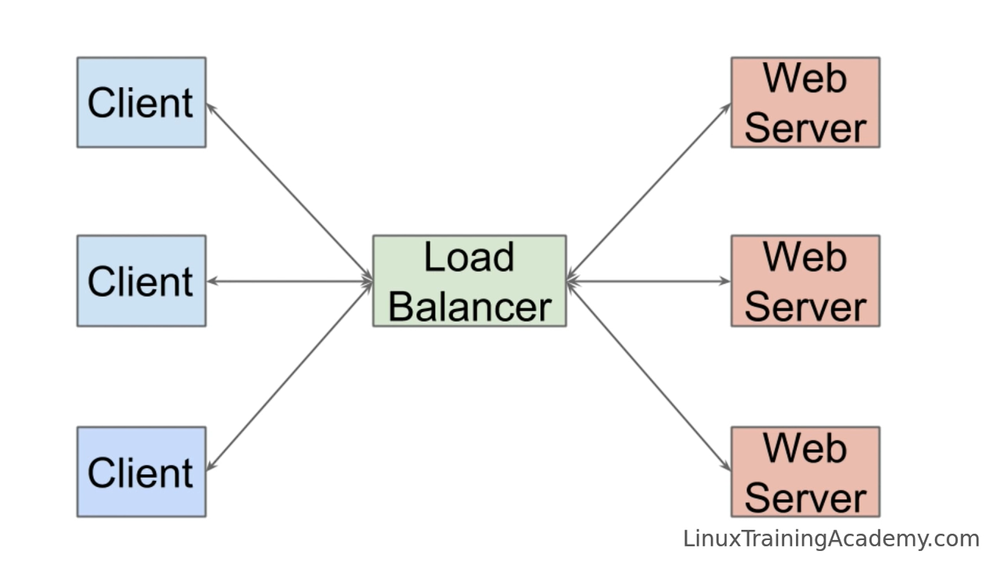
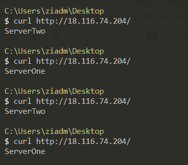

# Spin up a LoadBalancer


# Lets Start Building it 🛠
A load balancer is a device that acts as a reverse proxy and distributes network or application traffic across a number of servers. Load balancers are used to increase capacity **concurrent users** and **reliability** of applications.

OurCase:
* Use only one LoadBalncer and Two Servers for simplicity
* Spin only one AWS EC2-Ubuntu Instance
* Use ports 81 and 82 for the two servers
* Use port 80 for our load balancer

# Tasks
- [X] Install nginx
- [X] Set Up New Document Root Directories
- [X] Create Sample Pages for Each Site
- [X] Create Server Block Files for Each Port
- [X] Configure LoadBalncer node
- [X] Enable, Validate, Reload 
- [X] Check Results

# Install nginx

1- First run the following commands:
```console
* Update and Upgrade System
$ sudo apt-get update -y
$ sudo apt-get upgrade -y
```

2- Install Nginx:
```console
* Update and Upgrade System
$ sudo apt install nginx -y
```
# Set Up New Document Root Directories

We will create a directory structure within /var/www for each of our Servers.

1- Create Directories:
```console
$ sudo mkdir -p /var/www/ServerOne
$ sudo mkdir -p /var/www/ServerTwo
```

2- Give OwnerShip, write access, to our User:
```console
sudo chown -R $USER:$USER /var/www/ServerOne
sudo chown -R $USER:$USER /var/www/ServerTwo
```

3- Create Sample Pages for Each Site:
```console
$ echo ServerOne > /var/www/ServerOne/index.html
$ echo ServerTwo > /var/www/ServerTwo/index.html
```
# Create Server Block Files for Each Port

By default, Nginx contains one server block called default which we can use as a template for our own configurations. We will begin by designing our first domain’s server block, which we will then copy over for our second domain and make the necessary modifications.

1- Create the First Server Block File

```console
$ sudo cp /etc/nginx/sites-available/default /etc/nginx/sites-available/ServerOne
```

2- Edit it to look something like this at the end:
```
server {
        listen 81;
        listen [::]:81;

        server_name _;

        root /var/www/ServerOne;
        index index.html;

        location / {
                try_files $uri $uri/ =404;
        }
}
```

3- Create the Second Server Block File

```console
$ sudo cp /etc/nginx/sites-available/ServerOne /etc/nginx/sites-available/ServerTwo
```

4- Edit it to look something like this at the end **Notice Difference**:
```
server {
        listen 82;
        listen [::]:82;

        server_name _;

        root /var/www/ServerTwo;
        index index.html;

        location / {
                try_files $uri $uri/ =404;
        }
}
```

# Configure LoadBalncer node

3- Edit your default configuration

```console
$ sudo nano /etc/nginx/sites-available/default
```

4- Remove every thing and add the following:
```
upstream LoadBalancer {
        server localhost:81;
        server localhost:82;
}

server {
        listen 80;

        location / {
                proxy_pass http://LoadBalancer;
        }
}
```

# Enable, Validate, Reload

1- To Enable the sites you added run:
```console
$ sudo ln -s /etc/nginx/sites-available/ServerOne /etc/nginx/sites-enabled/
$ sudo ln -s /etc/nginx/sites-available/ServerTwo /etc/nginx/sites-enabled/
```

2- Validate the Configuration files to make sure you didin't spelled anything incorrectly
```console
$ sudo nginx -t
nginx: the configuration file /etc/nginx/nginx.conf syntax is ok
nginx: configuration file /etc/nginx/nginx.conf test is successful
```

3- Reload Nginx:
```console
$ sudo service nginx reload
```

# Check Results


